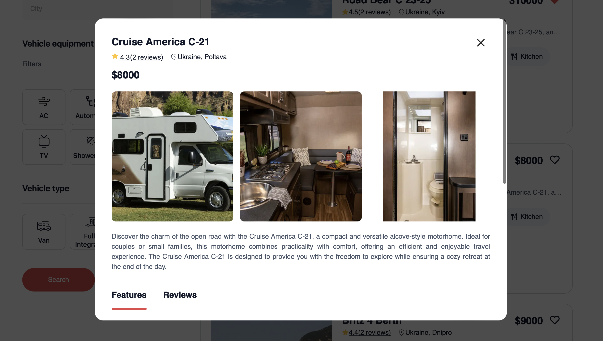

# TravelTrucs

This website is dedicated to the rental of campervans and motorhomes, offering a wide selection of vehicles for adventurous travelers. Our goal is to provide a seamless and enjoyable experience for customers looking to explore the outdoors with the freedom that a campervan offers.

[Visit my website](https://test-lake-one-20.vercel.app)

## Key Features

Vehicle Selection: A variety of campervans and motorhomes available for rent, catering to different group sizes and preferences.
Online Booking System: Users can easily browse available vehicles, select their desired dates, and make reservations directly through the website.
User-Friendly Interface: A clean and intuitive design that allows customers to quickly find the information they need, from vehicle specifications to pricing.

## Descriptions pages

On my website, there are two main pages: the Home page and the Catalog page. The Home page introduces visitors to the camper rental service, while the Catalog page offers a complete listing of available campers. Here, users can apply filters to refine their search. Additionally, there is a modal that allows users to view more detailed information about the selected campers.

## Details 

This project has been developed utilizing Vite, React, and Redux for the frontend, providing a modern and efficient user interface. Vite serves as a build tool that enhances the development experience with fast reloads and optimized builds. React is used for creating interactive components, while Redux manages the application’s state effectively, ensuring a smooth user experience.

On the backend, we employed Moskapi.io, which facilitates the creation of APIs and manages server-side functionality seamlessly. This combination allows for a robust and scalable application that can handle user requests efficiently while delivering a responsive and dynamic interface on the client side.

## Tools and technologies I utilized

